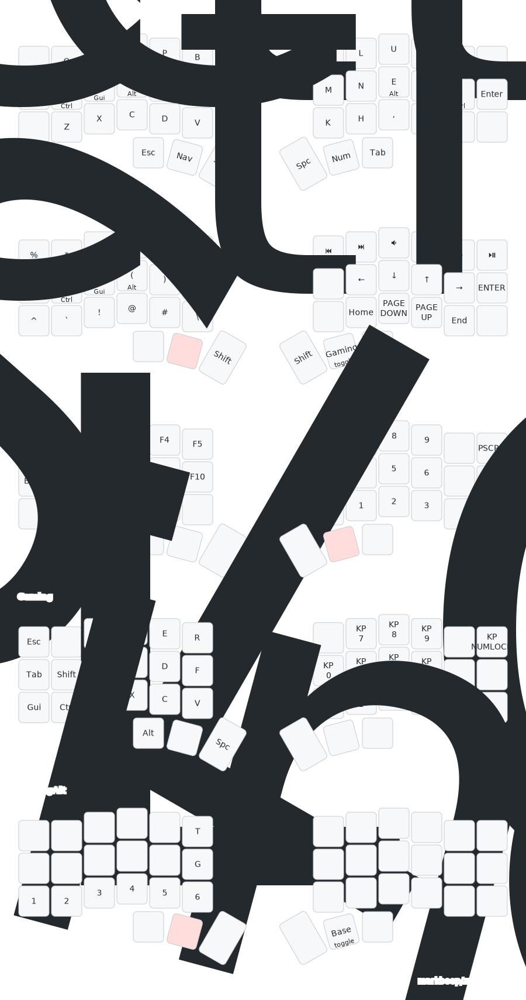

https://github.com/urob/zmk-config

### Build

Initialize if `.west` directory doesn't exist yet:
```bash
just init
```

Build board firmware locally:
```bash
just build all
# if it doesnt work because of some permission error, do the following
XDG_RUNTIME_DIR=/tmp just build all
```

Files are then located in `firmware/`


### Draw

```bash
just draw
```

`Could not find any keymap nodes with "zmk,keymap" compatible property` usually indicates zmk-helpers was not correctly included,
as is explained [here](https://github.com/urob/zmk-helpers/blob/main/docs/keymap_drawer.md).



